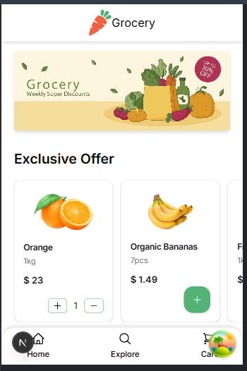
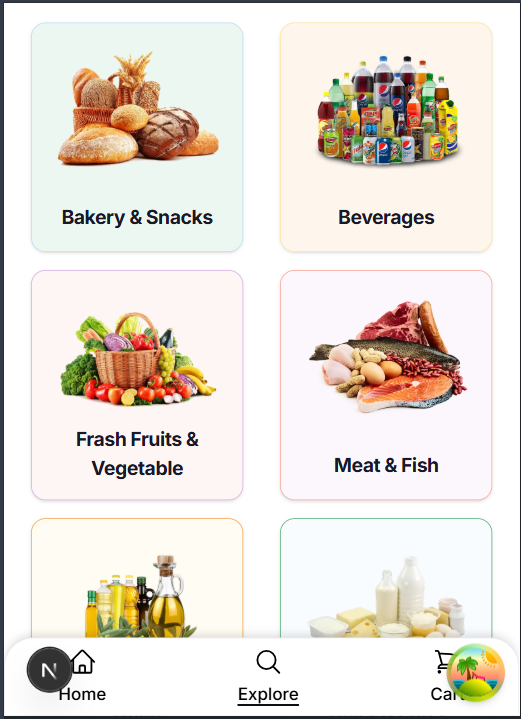
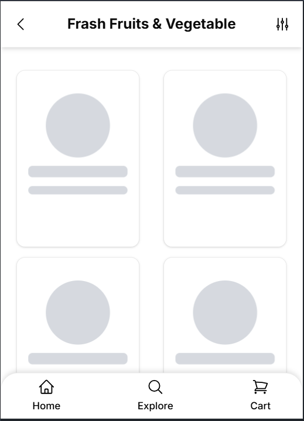
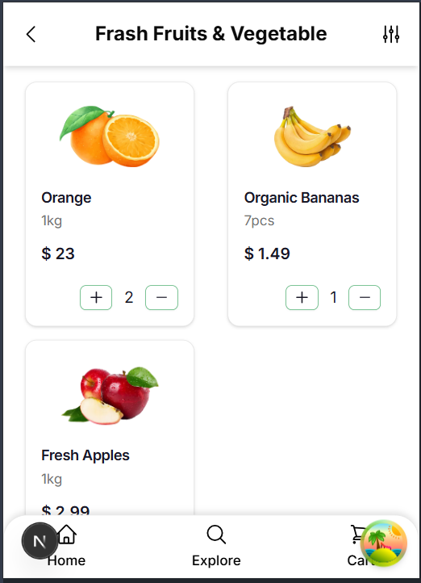
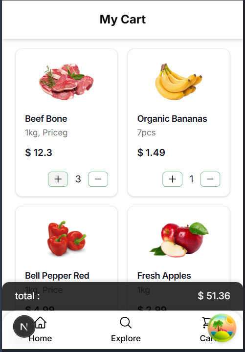
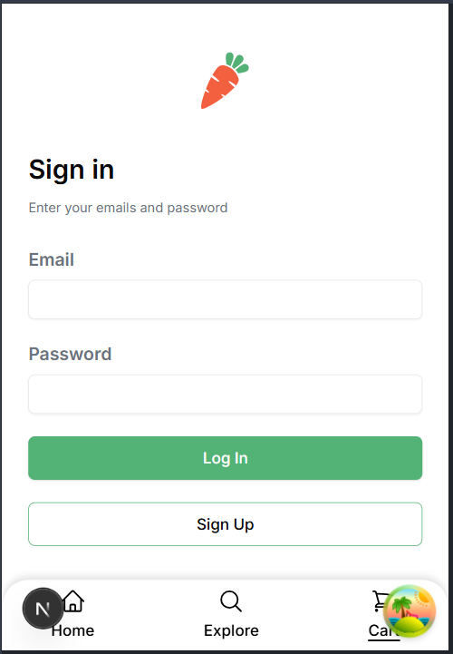

This is a [Next.js](https://nextjs.org/) project bootstrapped with [
`create-next-app`](https://github.com/vercel/next.js/tree/canary/packages/create-next-app).

| state management | zustand     |
|:----------------:|-------------|
|  data fetching   | react query |
|    ui library    | shadcn      |
|       css        | tailwind    |
|        DB        | firebase    |
|     rest api     | api routing |

- service layer and DAL for centralize ,Easier Updates
- custom fetch func for check authenticate user in some scenario
- middle ware to check Auth in some route group
- use streaming for reduce TTFB
- use custom fallback to control shift layout
- generate metadata for better SEO
- use priority and lazy load for images
- use optimistic update for shopping cart
- verify token func will be cache for decrease duplicate verify token on same route (by react cache func)
- loggedIn user will be accessed by zustand store on hole app
- use broadcast channel & persist plugin for share query cache between tabs in browser(in progress...)

